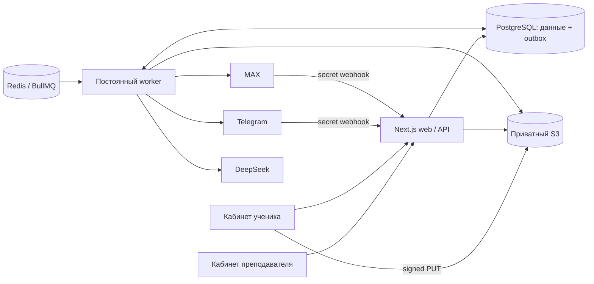

# Архитектура MVP

## Компоненты

Next.js App Router (React/TypeScript) объединяет frontend и Node.js API; PostgreSQL хранит данные, Redis/BullMQ запускает постоянный worker. Этот вариант использует Node.js из рекомендованного стека, с общими типами и бизнес-правилами вместо отдельного NestJS-сервиса.

Родитель не имеет web-аккаунта. Binding связывает его channel/chat/user с учеником. Можно подключить обоих родителей, несколько детей и оба канала; для каждой новой родительской привязки нужен актуальный одноразовый код.

## Данные и транзакции

У каждого преподавателя отдельный tenant. Сущности хранятся в таблицах `ft_accounts`, `ft_students`, `ft_groups`, `ft_lessons`, `ft_assignments`, `ft_submissions`, `ft_payments`, `ft_files`, `ft_invites`, `ft_sessions`, `ft_bindings`, `ft_linkTokens`, `ft_reports`, `ft_jobs`, `ft_flows`, `ft_receipts`, `ft_limits` (PostgreSQL приводит некавыченные имена к lowercase). Каждая строка содержит `id`, `tutor_id` с внешним ключом на `ft_tenants`, JSONB `data`. Есть индексы tenant, уникальные email и родительский код. `ft_schema` хранит версию миграции.

`userTransaction()` находит tenant по хешированной сессии и повторно проверяет сессию внутри транзакции. `transaction(fn, tutorId)` читает только строки с данным `tutor_id`, берет shared global advisory lock и отдельный exclusive lock tenant. Независимые преподаватели могут выполнять такие транзакции параллельно. Запись/удаление ограничены тем же tenant; upsert не меняет владельца существующего ID. Ошибки откатываются. Права дополнительно проверяются в домене и при отдаче snapshot/файлов.

**Оставшийся предел:** регистрация/вход, маршрутизация bot-событий и часть служебных операций пока выполняются через `transaction(fn)` с эксклюзивной общей блокировкой и чтением всех tenants. Worker планирует и обрабатывает обычные задания по tenant. Внутри tenant коллекции остаются JSONB и читаются полностью: для большой нагрузки нужны точечные SQL-запросы и нормализованные связи. PostgreSQL RLS пока не используется; изоляция обеспечивается приложением/SQL-фильтрами и тестами. Не выдавайте доступ к БД пользователям приложения.

Подписки хранятся отдельно от оплат занятий: `ft_subscriptions`, `ft_subscriptionPayments`, `ft_billingEvents`. Финансовые события не удаляются планировщиком. Миграция v2 создает эти таблицы, уникальный индекс provider ID и дает уже существующим преподавателям 14 дней с момента миграции. Новая регистрация получает ровно 14 дней от `createdAt`. Подробнее: [подписки](BILLING.md).

## API

| Метод/путь                                              | Действие                                                                                             |
| ------------------------------------------------------- | ---------------------------------------------------------------------------------------------------- |
| `GET /api/health`                                       | Доступность web/подключения к PostgreSQL                                                             |
| `GET /api/state`                                        | Snapshot, отфильтрованный по роли/tenant                                                             |
| `POST /api/auth/register`, `/login`, `/join`, `/logout` | Авторизация/одноразовое приглашение                                                                  |
| `POST /api/action`                                      | Валидируемые Zod-команды: student/group/lesson/assignment/submission/payment/settings/report/bot/job |
| `POST /api/files/presign`, `/complete`                  | Прямая S3-загрузка и верификация                                                                     |
| `GET /api/files/:id`                                    | Проверка прав, затем signed download 5 минут                                                         |
| `POST /api/files`                                       | Локальный upload только в development demo                                                           |
| `POST /api/webhooks/telegram`, `/max`                   | Проверка секрета, запись события в outbox                                                            |
| `GET /api/billing`                                      | Состояние подписки и последние 50 платежей преподавателя                                             |
| `POST /api/billing/checkout`, `/cancel`, `/check`       | Оплата, отключение автопродления, сверка незавершенных платежей                                      |
| `POST /api/webhooks/yookassa`                           | Проверка актуального платежа через API ЮKassa, применение результата                                 |
| `GET /api/export`                                       | JSON-экспорт кабинета преподавателя, доступен после истечения подписки                               |

Изменяющие web-запросы требуют Origin, совпадающий с APP_URL. Webhooks вместо cookie/Origin используют отдельный secret header. Сессия живет 7 дней, cookie HttpOnly/SameSite=Lax/Secure в production; в БД хранится hash токена. Приглашение действует 7 дней, messenger link — 15 минут; оба одноразовые. Пароль — минимум 12 символов, hash scrypt с солью. Восстановление пароля и подтверждение email пока не реализованы.

## Оплаты и посещаемость

- Пакетный баланс = начальный остаток + оплаченные занятия − проведенные посещенные занятия. Отмена, перенос и отмеченный пропуск ученика не списывают урок.
- При поурочной схеме проведенный посещенный урок создает долг; ставка фиксируется на момент проведения. Позднее изменение цены не меняет старый долг. Платеж закрывает выбранные неоплаченные уроки и должен совпадать с их суммой. Частичные платежи/возвраты не входят в MVP.
- Повторный статус «Проведен» не списывает занятие второй раз. Проведенные занятия в MVP неизменяемы; исправление финансовой истории требует отдельного будущего сценария, а не удаления.
- Начальный остаток и схема расчетов не меняются после появления финансовой истории. Существующие данные нельзя незаметно пересчитать переключением схемы.
- Поурочное уведомление ставится в outbox сразу при проведении. Для пакета оно создается при остатке 1 или отрицательном остатке; ровно 0 не имеет отдельного уведомления согласно ТЗ.

Учет оплат занятий ручной: преподаватель сам фиксирует факт оплаты ученика. Оплата подписки на платформу проводится отдельно через ЮKassa и подтверждается сервером.

## Напоминания, повторы и надежность

Redis содержит BullMQ JobScheduler: tick каждые 15 секунд. PostgreSQL outbox содержит конкретные bot/message/report задания. Worker обрабатывает до 10 за tick, конкурентность 1, пауза 1,1 секунды между заданиями. Внешние сетевые вызовы идут вне транзакции БД. Задание захватывается с lease 5 минут; после падения процесс может его вернуть в обработку.

Telegram по умолчанию получает события через отдельный long-polling цикл worker (`getUpdates`, ожидание 20 секунд), используя тот же исходящий HTTP-прокси, что и ответы/файлы. Установка webhook отменяется при настройке без удаления pending updates. PostgreSQL session advisory lock на отдельном соединении защищает от двух poller одного токена; долгий API-вызов не держит транзакцию или общий tenant-lock. События и следующий offset атомарно сохраняются в системном outbox и receipt с отпечатком токена. Новые события запускают дополнительный tick BullMQ; периодический tick остается страховкой. `SIGTERM` прерывает long polling до закрытия очереди и пула БД. Режим `TELEGRAM_UPDATE_MODE=webhook` доступен отдельно; MAX продолжает использовать webhook.

Уроки: за 24 и 2 часа, окно планирования в течение часа после порога. ДЗ: за 24 часа и в календарный день дедлайна по timezone преподавателя, обычно начиная с 09:00 либо за 2 часа до раннего срока. После сдачи работа больше не напоминается; отмена урока и архив ДЗ прекращают новые напоминания. Перенос включает новую дату в ключ напоминания.

Для каждого назначения/порога/binding используется уникальный outbox ID. Telegram использует один ключ отпечаток токена + `update_id` для polling и webhook; остальные события защищены hash события и receipts. Подтверждение ДЗ защищено состоянием работы. Доставка через внешний API имеет семантику **at least once**: если провайдер принял сообщение, но сеть оборвалась до ответа/commit, возможен повтор. Обещания exactly-once нет. Отправки родителю в два подключенных канала выполняются отдельно.

Ошибки доставки повторяются до 5 попыток с увеличением задержки (60, 120, 240, 480 секунд; верхний предел часа). После этого failed-задачу можно перезапустить из настроек преподавателя. При отключении binding ожидающая отправка пропускается. Готовый отчет при retry не генерируется заново: повторяется доставка сохраненного текста.

Если worker выключен дольше окна напоминания, пропущенные старые напоминания не рассылаются задним числом. Финансовые сообщения/входящие события/отчеты остаются в PostgreSQL и будут обработаны после восстановления. Heartbeat контейнера обновляется после успешного tick, health считает его устаревшим через 20 минут с запасом на AI-пакет. Мониторинг очереди/ошибок worker обязателен для реальной доставки вовремя.

## Отчеты и файлы

DeepSeek получает только учебный контекст расчетного периода. Подсказка запрещает придумывать факты/динамику, требует простой дружелюбный язык. Полученный текст сохраняется, доступен преподавателю и автоматически отправляется родителям. Генерация и доставка — разные состояния: отчет может быть готов при ошибке отправки.

Web upload: временный `staging/` объект → copy в новый уникальный final key → Head/Range проверка → доступный StoredFile. Права скачивания проверяются по назначению/работе/владельцу. Ученику не доступны файлы другого ученика, даже если оба занимаются у одного преподавателя. Разрешены реальные JPG/PNG/PDF до 20 МБ; содержимое всегда отдается как скачиваемое вложение.

## Что не входит в этот MVP

Эквайринг оплат занятий, автоматическое применение возвратов подписки, видеосвязь, email-рассылки, password reset/email verification, web-кабинет администратора, полное удаление аккаунта, редактирование всей серии одним действием, автоматическая проверка ДЗ и антивирусная обработка. Для поддержки подписок есть защищенные доступом к VPS команды `scripts/billing-admin.ts`; экспорт кабинета доступен через API. Ежемесячный режим учебного отчета остается интервалом 30 дней; платная подписка использует календарный месяц. Мониторинг и согласия на обработку учебных данных настраиваются владельцем deployment.

Перед публичным запуском владелец добавляет собственные пользовательские условия/политику обработки данных, согласия и сроки хранения, исходя из своей юрисдикции и использования данных несовершеннолетних. Согласия собираются вне платформы; отдельного переключателя и проверки согласия в приложении нет.
